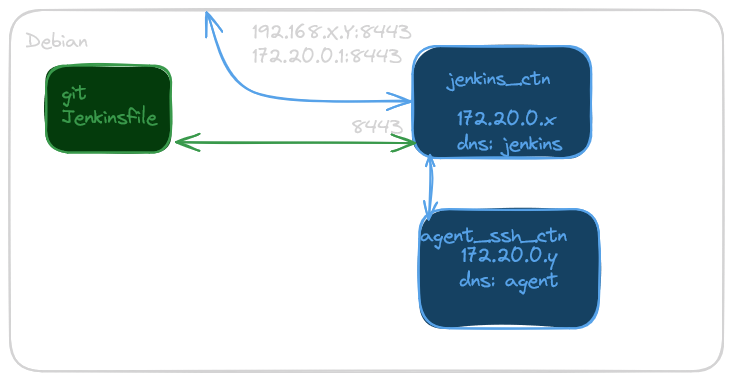

# SETUP JENKINS

---

## structure

### vM

* VM debian + git + docker + java 17
* stack jenkins avec
   - gestion du TLS (auto signé)
   - extra_hosts car pas de service dns (maquette)

### conteneur / image jenkins

* `~/jenkins/compose.yml` gère le lancement de jenkins
```bash
# lancement, dans le dossier contenant compose.yml
docker compose up -d
# arrêt
docker compose down
# checker
docker compose ps
```

* images docker utilisées
  - `docker images`

* troubleshooting dans les conteneurs
  - docker compose exec -it jenkins /bin/bash
  - docker exec -it agent /bin/bash 

### type de jenkins

* pipeline:
   - défini par Jenkinsfile
   - fichier contenu dans un dépôt git
   - scruté par le projet jenkins
   # - utilisant l'agent docker => chaque job automatisé exécuté dans un conteneur

* procédure:
   - Administrer Jenkins
   - plugins
   - plugins disponibles
     + pipeline
     + git
     + SSH Build Agent
     + maven
     + coverage

---

## projet jenkins

### création

* Dashboard
  - new item => appelé **dev**
  - type "pipeline"

### configuration du projet
  - bypasser la confirmation "known_hosts"
    + Administrer Jenkins
    + sécurité
    + section "Git Host Key Verification Configuration" > **no verification**
  - espace du projet dev
  - configurer
  - section pipeline
    + definition => **pipeline from SCM**
    + SCM > git
    + URL: git@jenkins.myusine.fr:dev.git
    + créer un **credential** (cf infra)
  - ajouter credential
    + identifiants globaux (illimité)
    + ssh username et clé 
    + id: jenkins-pkey
    + username: **git**
    + contenu: de la clé privée `~/.ssh/jenkins` (côté host)
    + la passphrase: **roottoor**

### Agent SSH

* par défaut, jenkins exécute les jobs dans le conteneur jenkins, en local
  -  il faut soulager le "noeud manager" qui gère les flux jenkins
  - en utilisant un "noeud worker" qui gère la cicd en tant que délégation
  - un conteneur adossé au conteneur Jenkins, considérés comme des **Nodes** différents

* configuration: [doc](https://www.jenkins.io/doc/book/using/using-agents/)
  - création des clés SSH => ssh-keygen
    + SOIT un protocole > ed25519 SOIT ssh-keygen -b 'xxxx' pour augmenter la taille de la clé rsa / ecdsa / ...
  - création du Crédential dans Jenkins
  - création du conteneur agent docker

  ```bash
  docker run \
  --name=agent -d \
  --net jenkins-net \
  -e "JENKINS_AGENT_SSH_PUBKEY=<pubkey_content>" \
  jenkins/ssh-agent:alpine-jdk17
  ```
  - configuration de l'agent
    + Administrer Jenkins
    + nodes
    + > global sur le scope
    + new node
    + nom: agent
    + rootdir: /home/jenkins (sur le ctn agent)
    + launch via SSH (cf infra)
  - configuration SSH
    + host: agent -> nom du conteneur = alias réseau sur le réseau interne 172.20.0.0/24
    + credential : jenkins
    + no HOst Key Confirmation
## SCHEMA COMPLET



## ajouter l'authentification

* => warning sur l'absence d'authentification
* règlage de sécurité 
  + utiliser la base de données d'utilisateur
  + accès aux fonctionnalités pour les users connectés
  + save
* creer le 1er admin user 
* dashboard menu utilisateur
  + securité
  + jeton d'API > 111883a1f836ce749937f0c23d3c858e52

## jeton d'accès pour check git

* administrer jenkins
* securité
* Git plugin notifyCommit access tokens
* access token > 465d3a19b22575c99e0c0f4e433905e7
